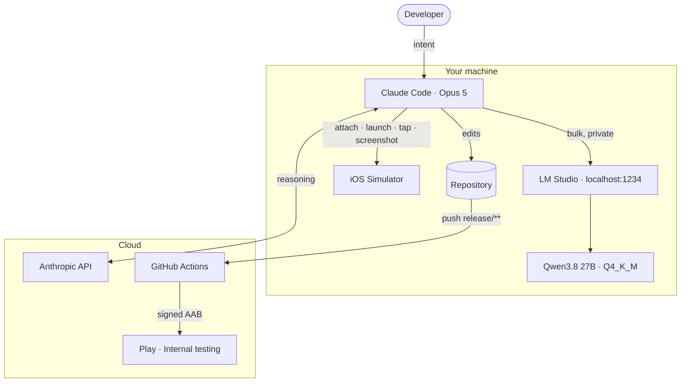
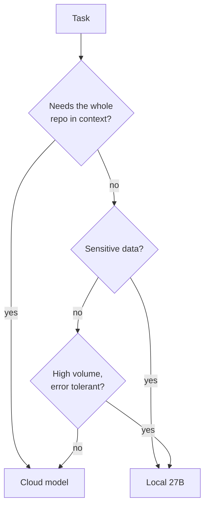
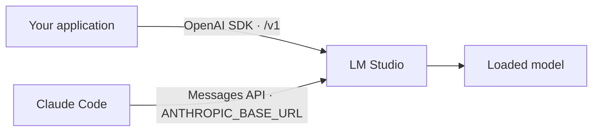
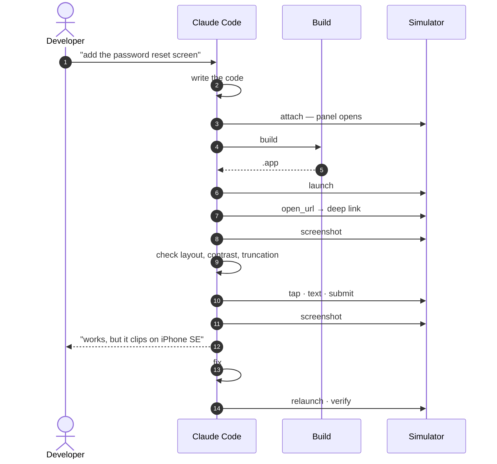
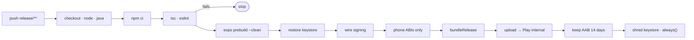
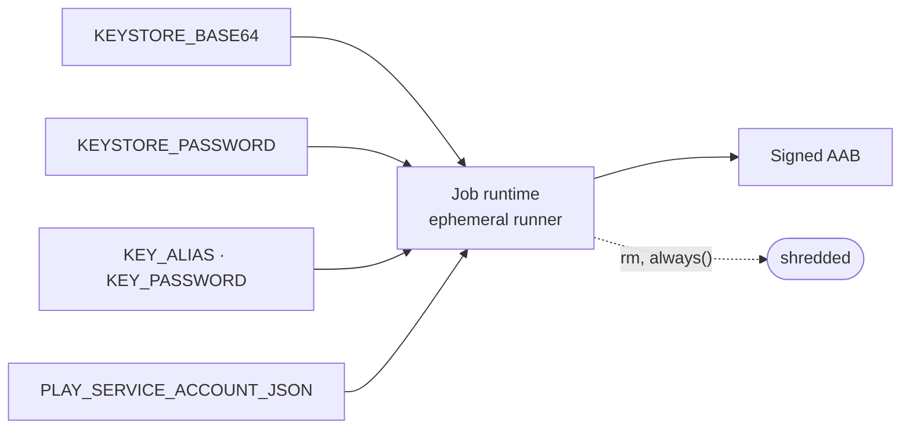

# Architecture

## The three tiers

The agent is the only component that touches all the others. That is the whole
point: reading the repo, calling the local model and pressing the screen happen
in one conversation, with no human ferrying results between windows.

## Routing a task

Judgement goes to the cloud. Repetition stays home.

| Task | Tier |
|---|---|
| Multi-file refactor, architecture | Cloud |
| Writing tests, guided debugging | Cloud |
| Classifying log lines | Local |
| OCR on screenshots | Local |
| Fixtures and seed data | Local |
| Summarising a long diff | Local |
| Driving the simulator | Connector |

## Two APIs, two callers

LM Studio speaks both. Applications use the OpenAI-compatible endpoint and need
no code changes. A Claude client can be pointed at the Anthropic-compatible one —
useful offline, but not a substitute for a frontier model on the main loop.

## The verification loop

Verification lands in the same motion as the change, while the reasoning is still
loaded — not twenty minutes later.

## Shipping Android

## Secret lifetime

No third-party build service holds the signing key. The Play service account
should carry exactly one permission — release to internal testing. If it leaks,
the blast radius is a bad build on a track testers can roll back.
